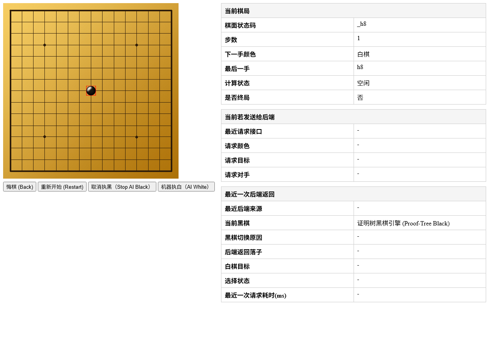
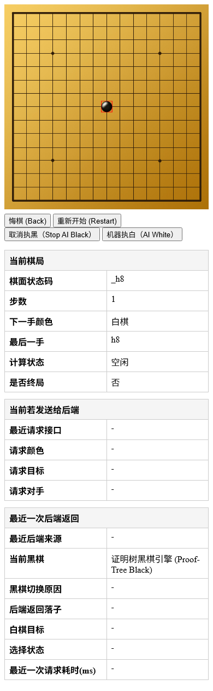
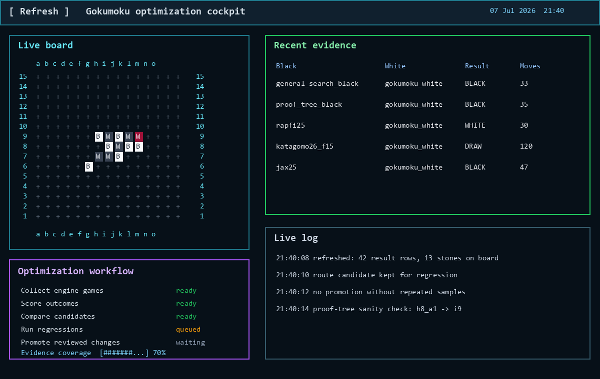

# Gokumoku

Gokumoku 是一个混合架构五子棋引擎：它把先手证明树、脱离证明树后的强搜索，以及基于历史对局数据调校的白棋决策层整合到同一套系统里。

网页棋盘只是最方便的体验入口。项目真正重要的部分，是引擎组合、自动对战工具和本地评测流程：每次调整都应该能被固定参数的对局验证，而不是只凭单局观感判断。







## 引擎架构

Gokumoku 对黑棋和白棋采用不同策略，因为两边要解决的问题并不一样。

黑棋部分结合了两类能力：在先手证明数据覆盖的局面里，沿证明树给出精确延续；在自摆残局、异常开局等脱离证明树的局面下，切换到通用强搜索，继续给出计算上几乎最佳的实战落子。

白棋部分是 Gokumoku 自己的防守决策层。它先检查直接胜负手，再用强搜索做局部判断；如果配置了 Gomocup 兼容引擎，还可以参考多个外部引擎的建议。同时，系统会把历史自对弈和引擎对战沉淀为经验应对库，用来偏向更稳、更持久，或更有反击机会的分支。白棋的目标不是机械挡棋，而是在黑棋保持最强变化时尽量延长抵抗，在黑棋偏离强应对时抓住战术机会。

## 功能

- 混合黑棋引擎：证明树延续加通用强搜索。
- 白棋引擎：战术检查、搜索信号、可选引擎投票和历史对局经验库。
- 浏览器棋盘：手动摆盘、机器执黑、机器执白、悔棋、重新开始和胜负判断。
- `/next_step`：黑棋接口。
- `/white_next_step`：白棋接口。
- PBrain/Gomocup 兼容对战工具。
- 本地对战评估工具，包含角色固定的 Elo 辅助估计。
- Textual TUI 仪表盘，可查看棋盘、对局证据和优化流程。
- 局域网代理，可从同一网络内的其他设备访问棋盘。

## 项目结构

```text
server/
  white_ai_server.py        HTTP 服务与当前引擎编排
  web/gomoku.html           浏览器棋盘，保留原棋盘素材和坐标系统
tools/
  pbrain_match_runner.py    固定参数对战工具，支持 HTTP 与 PBrain 引擎
  evaluate_tournaments.py   JSONL 汇总与本地表现 Elo 辅助估计
  gokumoku_tui.py           Textual 仪表盘，用于观察对局和评测证据
  lan_proxy.js              局域网访问代理
docs/
  ARCHITECTURE_REVIEW.md    当前架构边界和后续拆分建议
  AUTOMATION.md             可续跑评测流程与 TUI 使用说明
  assets/                   前端和 TUI 截图
```

## 本地结果

下面是本地实验记录，不是 Gomocup 官方排名，也不是官方 Elo。

Elo 锚点来自 Gomocup Freestyle20 榜单，查询日期为 2026-07-07：RAPFI 2025 为 3073，KATAGOMO 2026 为 2879，ALPHAGOMOKU (MK) 2026 为 2781，JAX 2025 为 2662，EMBRYO 2026 为 2372，YIXIN 2018 为 2217，VIBEFIVE 2026 为 2172，PENTAZEN 2021 为 2171。

| 检查 | 设置 | 结果 |
|---|---:|---|
| 线上兼容黑棋检查 | `https://gomoku.hula.ai/next_step`，`_h8_a1`，高等级 | 返回 `i9` |
| 本地证明树黑棋检查 | 同一局面和参数，完整本地资源 | 从 LevelDB 返回 `i9` |
| 通用搜索黑棋 vs 基线白棋策略 | depth 64，4 线程，5000 ms/手 | BLACK/21 |
| 通用搜索黑棋 vs Gokumoku 白棋 | depth 64，4 线程，5000 ms/手 | BLACK/33 |
| 证明树兼容黑棋 vs Gokumoku 白棋 | 本地完整强度配置 | BLACK/35 |
| 本地 11 引擎验收测试 | depth 4，1 线程，500 ms/手 | 5W-0D-6L，本地锚点表现约 2452 |
| 本地 14 引擎扩展检查 | 两组单轮文件，depth 4，1 线程，500 ms/手 | 30 局合计 13W-1D-16L，本地锚点表现约 2475 |
| 早期 7 引擎重复检查 | 3 次重复，500 ms/手 | 对有公开分数的对手为 6W-0D-12L，本地锚点表现约 2536 |

Elo 状态：`tools/evaluate_tournaments.py` 会根据 JSONL 中出现的对手，计算角色固定的本地表现估计。它适合比较本地模型版本，不是 Gomocup 官方评级，也不能当作榜单排名。

## 本地运行

安装依赖：

```bash
python -m pip install -r requirements.txt
```

创建本地配置：

```bash
cp .env.example .env
```

在 `.env` 里配置证明数据、Rapfi 和可选 Gomocup 兼容引擎路径。

启动服务：

```bash
cd server
python white_ai_server.py 8090
```

打开：

```text
http://127.0.0.1:8090/gomoku.html
```

如果要让局域网里的其他设备访问：

```bash
node tools/lan_proxy.js --listen-host=<你的局域网IP> --listen-port=8090 --target-host=127.0.0.1 --target-port=8090
```

## 自动评测

运行一局固定参数对战：

```bash
python tools/pbrain_match_runner.py \
  --black http_proof_tree_black \
  --white http_gokumoku_white \
  --http-base http://127.0.0.1:8090 \
  --depth 4 \
  --threads 1 \
  --turn-time-ms 500 \
  --compact
```

汇总 JSONL 结果：

```bash
python tools/evaluate_tournaments.py benchmarks/*.jsonl --group black-target --performance-elo
```

打开 TUI 仪表盘：

```bash
python tools/gokumoku_tui.py --results "benchmarks/*.jsonl"
```

更多说明见 [Automation And TUI](docs/AUTOMATION.md) 和 [Architecture Review](docs/ARCHITECTURE_REVIEW.md)。

## 外部资源

这个 clean 仓库不打包大型引擎、神经网络权重、证明数据库或原始 benchmark 日志。

如果要达到完整强度，需要自行准备：

- [`fucusy/gomoku-first-move-always-win`](https://github.com/fucusy/gomoku-first-move-always-win) 的先手证明数据和 LevelDB 文件
- 如果需要 LevelDB 命中之外的证明搜索行为，还需要对应的证明搜索二进制
- Rapfi 可执行文件和网络权重
- 可选的 Gomocup 兼容 PBrain 引擎目录

缺少这些资源时，网页仍然可以打开，但引擎强度不会等同于上面的实验结果。

## 致谢

Gokumoku 基于并整合了以下开源项目或公开生态中的组件与思路：

- [`fucusy/gomoku-first-move-always-win`](https://github.com/fucusy/gomoku-first-move-always-win)
- [`dhbloo/gomoku-calculator`](https://github.com/dhbloo/gomoku-calculator)
- [`dhbloo/rapfi`](https://github.com/dhbloo/rapfi)
- [Gomocup](https://gomocup.org/) 及其 AI 生态
- jQuery

许可证和再分发说明见 [NOTICE.md](NOTICE.md)。
